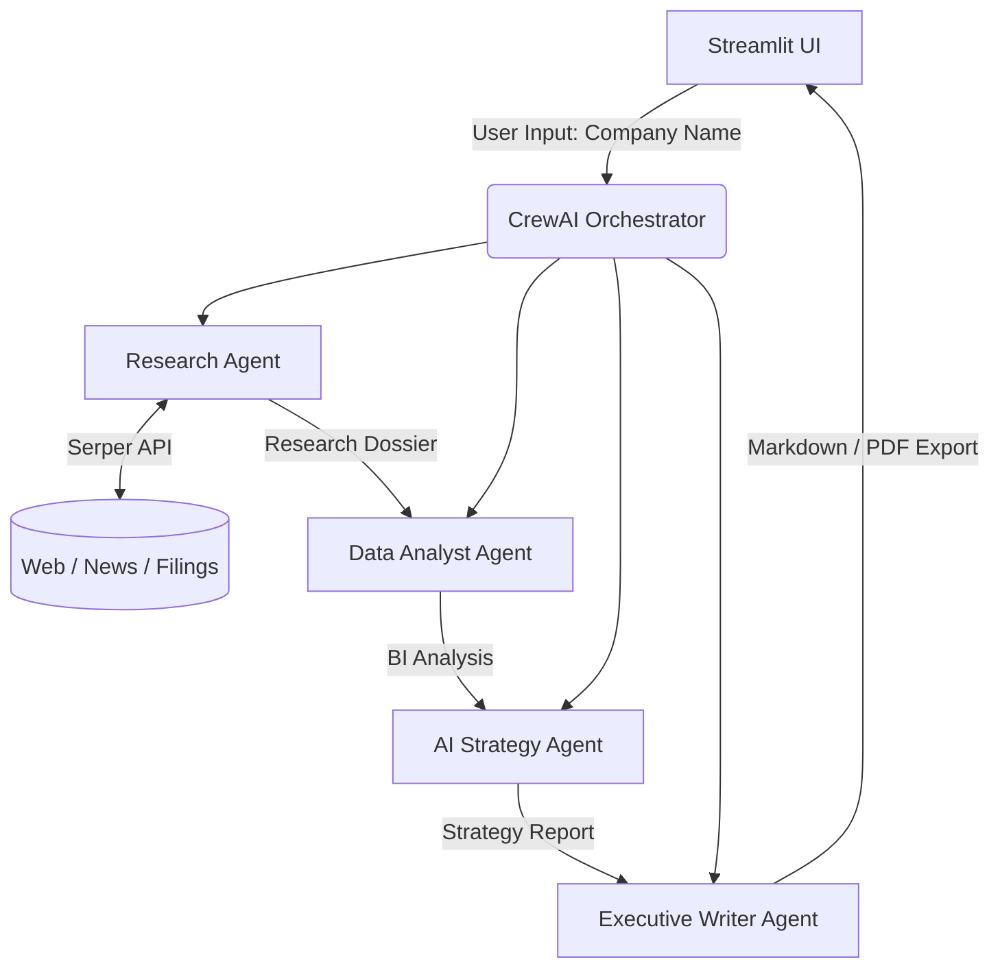
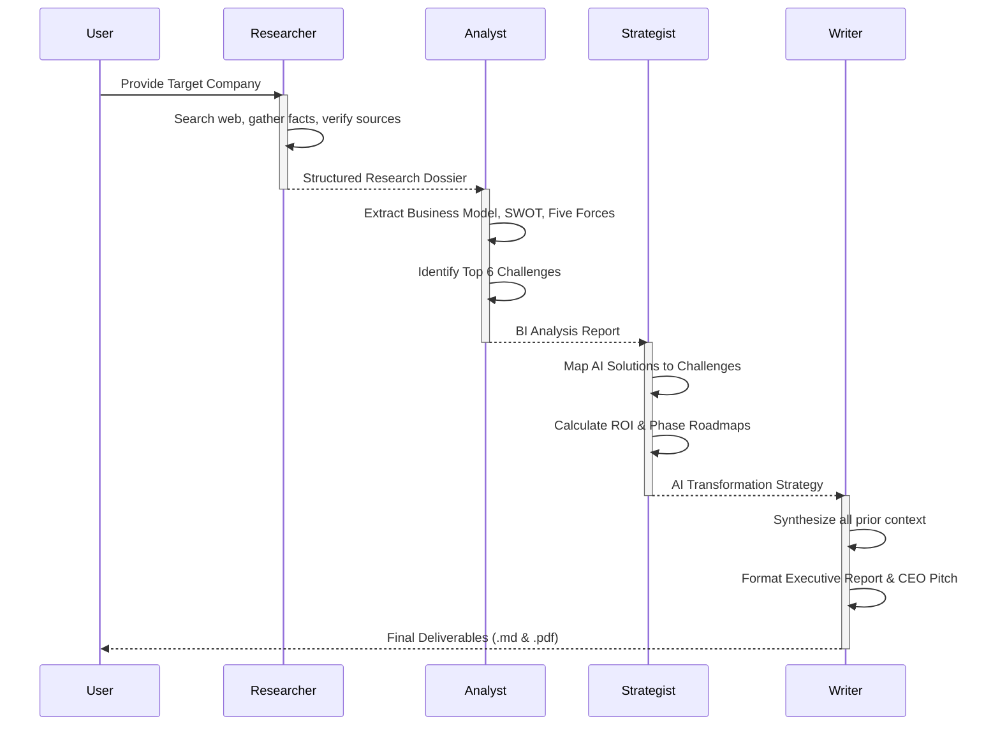

# InsightForge AI


<p align="center">
  <em>An Autonomous Multi-Agent Business Intelligence & Strategy Consulting Platform</em>
</p>

---

## Overview

**InsightForge AI** is a production-grade, multi-agent artificial intelligence system designed to automate deep corporate research, competitive analysis, and strategic consulting. By leveraging a sequential pipeline of specialized AI agents, the platform ingests a target company's name and autonomously synthesizes public data into actionable business intelligence, culminating in executive-ready markdown and PDF reports.

---

## Why This Project Matters (Business Value)

In the traditional management consulting workflow, gathering corporate intelligence, structuring competitive analysis, and proposing viable AI transformation strategies takes a team of analysts days or weeks. 

InsightForge AI reduces this latency to **minutes** without sacrificing depth. By orchestrating LLMs with specific domain personas (Researcher, Analyst, Strategist, Writer), the system eliminates cognitive overload, reduces hallucination through constrained context passing, and delivers highly structured, deterministic outputs that founders, investors, and strategy teams can act upon immediately.

---

## What Recruiters & Hiring Managers Should Notice

This project was built to demonstrate readiness for production-level AI and Software Engineering roles. Key technical signals include:

* **End-to-End Product Development:** Built a complete, interactive full-stack application from backend orchestration to a reactive Streamlit frontend.
* **Multi-Agent Orchestration:** Successfully designed and implemented a specialized 4-agent `CrewAI` pipeline, managing state and context boundaries to prevent token bloat.
* **LLM Engineering & Cost Optimization:** Implemented a split-model architecture (e.g., Llama 3.1 8B for I/O tasks, 70B for deep reasoning) and robust API retry/backoff mechanisms to strictly adhere to free-tier Rate Limits (12k TPM) while maintaining high output quality.
* **Prompt Engineering:** Designed constrained, highly specific system prompts enforcing deterministic markdown formats and structured JSON-like table generation.
* **Software Architecture:** Separated concerns across modular files (Agents, Tasks, UI, Config), implemented a global `TEST_MODE` for CI/CD-like rapid iteration, and handled asynchronous LLM streaming cleanly.

---

## Architecture & System Design

InsightForge AI relies on a highly decoupled architecture where specialized agents only receive the exact context they need, preventing the "lost in the middle" phenomenon and massive token costs.

### System Architecture



### Agent Workflow



---

## Key Features

- **Autonomous Web Research:** Uses Serper API to scrape real-time company news, financials, and competitor data.
- **Sequential Multi-Agent Pipeline:** 4 distinct AI personas passing structured context down the chain.
- **Split-Model Optimization:** Dynamically routes simpler tasks to faster, cheaper models and complex reasoning to larger models.
- **Robust Error Handling:** Custom `rate_limit_retry` wrapper automatically parses API rate limit headers and executes exponential backoff.
- **Dynamic UI State Management:** Flawless Streamlit widget callback integration prevents state mutation errors during long-running tasks.
- **Executive PDF Export:** Uses ReportLab to convert generated markdown into professional PDF deliverables.
- **Test Mode Capability:** Environment-driven lightweight testing mode to rapidly verify pipeline integrity without consuming massive API quotas.

---

## Tech Stack

* **Core Application:** Python 3.10+
* **Frontend:** Streamlit
* **AI Framework:** CrewAI, LiteLLM
* **LLM Provider:** Groq (Llama-3.3-70b-versatile, Llama-3.1-8b-instant)
* **Search Tool:** Serper API
* **Document Generation:** ReportLab, Markdown

---

## Installation & Setup

### Prerequisites
* Python 3.10 or higher
* API Keys for [Groq](https://console.groq.com/) and [Serper](https://serper.dev/)

### 1. Clone the Repository
```bash
git clone https://github.com/dev11062004/InSightForge-AI.git
cd InSightForge-AI
```

### 2. Create a Virtual Environment
```bash
python -m venv .venv
source .venv/bin/activate  # On Windows use: .venv\Scripts\activate
```

### 3. Install Dependencies
```bash
pip install -r requirements.txt
```

### 4. Configure Environment Variables
Create a `.env` file in the root directory:
```env
# API Keys
GROQ_API_KEY=your_groq_api_key
SERPER_API_KEY=your_serper_api_key

# Execution Mode
TEST_MODE=false
```

### 5. Run the Application
```bash
streamlit run app.py
```

---

## Usage Guide & Sample Workflow

1. **Launch the UI:** Open `http://localhost:8501`.
2. **Input Company:** Enter a target company (e.g., "NVIDIA", "Stripe", or use quick-select options).
3. **Monitor Execution:** Watch the live progress as each agent takes over the task.
4. **Review Outputs:** Once complete, navigate the generated tabs to view the `Research Findings`, `Analysis`, `Strategy`, and the final `Executive Report`.
5. **Export:** Download the finalized report as a PDF.

*(Insert UI Action Screenshot Here)*


---

## Folder Structure

```text
InSightForge-AI/
├── .env                    # Environment secrets & config flags
├── app.py                  # Streamlit frontend & state management
├── crew.py                 # CrewAI pipeline orchestration
├── test_mode.py            # Global testing configuration
├── rate_limit_retry.py     # Custom API backoff & retry logic
├── groq_patch.py           # Compatibility patch for LiteLLM
├── requirements.txt        # Python dependencies
├── agents/                 # Agent Definitions
│   ├── research_specialist.py
│   ├── data_analyst.py
│   ├── ai_strategy_agent.py
│   └── content_writer.py
└── tasks/                  # Task Prompts & Expected Outputs
    ├── research_task.py
    ├── analysis_task.py
    ├── ai_strategy_task.py
    └── writing_task.py
```

---

## Engineering Decisions & Challenges Solved

### 1. Defeating Token Bloat & Rate Limits
**Challenge:** Initially, the sequential pipeline appended every agent's output into a massive shared context window. By the final writer agent, the prompt exceeded 10k tokens, triggering Groq's 12k TPM rate limits and crashing the app.
**Solution:** 
- Implemented **Context Chain Pruning**: The Strategy agent *only* receives the Analyst's output (which inherently contains the synthesized research). The Writer *only* receives the Strategy output.
- **Split-Model Routing**: Assigned `llama-3.1-8b-instant` for data extraction (Research/Analysis) and reserved the heavy `llama-3.3-70b-versatile` strictly for complex reasoning (Strategy/Writing).

### 2. Streamlit Lifecycle Conflicts
**Challenge:** Using standard `st.session_state` updates inside loops caused `StreamlitAPIException` due to widget instantiation conflicts.
**Solution:** Migrated to strict `on_click` callback architectures for widget interactions, completely separating state mutation from UI rendering.

### 3. Graceful Fault Tolerance
**Challenge:** Temporary API hiccups or network latency ruined multi-minute executions.
**Solution:** Developed `rate_limit_retry.py` to wrap LiteLLM calls, catching HTTP 429s, parsing the `Retry-After` header, executing precise exponential backoff, and returning user-friendly UI toasts instead of raw stack traces.

---

## Performance & Scalability Notes

- **Optimized Latency:** The entire 4-agent pipeline executes in under 2 minutes in production mode.
- **Test Mode:** Built a `TEST_MODE` toggle that shrinks outputs to 60 words and 1 iteration. This allows for instant CI/CD pipeline verification and UI testing without burning production API quotas.
- **Stateless:** The core `crew.py` execution is stateless, making it trivial to scale horizontally via Celery or AWS SQS in a future cloud deployment.

---

## Future Improvements

1. **Vector Database Integration:** Integrate Pinecone or ChromaDB to give agents "memory" of past company analyses.
2. **Human-in-the-Loop (HITL):** Allow users to intervene and correct the Analyst's assumptions before the Strategist begins its work.
3. **Data Visualization:** Auto-generate matplotlib or plotly charts for financial trends based on the research agent's data.

---

## Learning Outcomes

Building InsightForge AI provided deep, hands-on experience in:
- Designing non-trivial Agentic Workflows.
- Managing strict LLM output formatting.
- Navigating the complexities of stateful UIs in Streamlit.
- Building resilient integrations with external APIs and understanding token economics.

---
*Created by [Birva](https://github.com/dev11062004) — Seeking Opportunities in Software Engineering, AI/ML, and Generative AI.*
